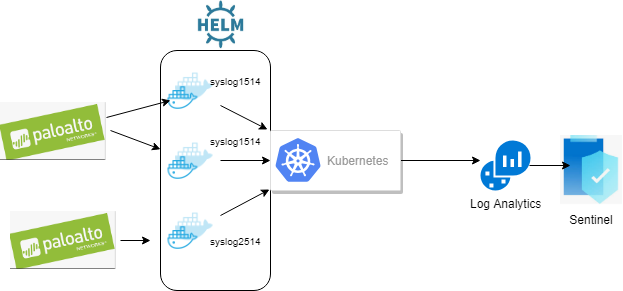

# Introduction 
Syslog to Log Analytics (Sentinel). This is alternative to Sentinel connectors using Kubernetes and Logstash

# Getting Started

Look at [My blog post](https://medium.com/@IrekRomaniuk/syslog-to-azure-sentinel-ac7a5902c33e)
also [Logstash Chart documentation](https://github.com/helm/charts/tree/master/stable/logstash) and [Azure Log Analytics output plugin for Logstash](https://github.com/yokawasa/logstash-output-azure_loganalytics). 
Below is example with Palo Alto Networks (see _values.PanTraffic.yaml_ and _values.PanThreat.yaml_ in *shakl/charts/logstash/*)



# Build and Test notes

*azure-pipelines.yml* to build and upload image to registry (repository: _name.azurecr.io/shakl_), see _values.yaml_

```
helm del --purge loggen
helm install -f charts/logstash/values.Loggen.yaml charts/logstash/ --name loggen --set replicaCount=2

UDP: loggen --inet --dgram --size 300 --rate 1000 --interval 10 10.161.132.35 6666
TCP: loggen --size 300 --rate 1000 --interval 10 10.161.132.38 6667

workspace('defaultaworkspace').Loggen_CL | where TimeGenerated > now() - 10m | count
```

# Contribute
TODO: Explain how other users and developers can contribute to make your code better. 
